<div align="center">
  
  <h1>Arynox AI Call Assistant</h1>
  <p><strong>Private, USB-only cellular calling for local AI agents.</strong></p>
  <p>Turn a rooted Android phone into a secure voice endpoint for Groq, Hermes, OpenClaw, and Human Desktop Operators.</p>

  <p>
    <a href="LICENSE"></a>
    <a href="LICENSE"></a>
  </p>

  <p>
    <a href="docs/INSTALL.md"><strong>Installation</strong></a>
    · <a href="docs/ARCHITECTURE.md"><strong>Architecture</strong></a>
    · <a href="docs/MCP.md"><strong>MCP guide</strong></a>
    · <a href="docs/security/threat-model-and-recording-controls.md"><strong>Security</strong></a>
  </p>
</div>

> [!NOTE]
> Arynox AI Call Assistant is a fork of the [AgentCall](https://github.com/sidinsearch/AgentCall)
> project, extended with Groq speech and language models, and maintained by
> **Aryan Chavan · ArynoxTech**. Internal protocol identifiers, package names,
> and service identifiers retain the stable `agentcall` names for safe upgrades.

> [!IMPORTANT]
> Arynox AI Call Assistant v1.0.1 is the current **hardware-qualified patch release** for the
> Xiaomi POCO M2 Pro reference setup. The Android APK and matched Magisk
> module use the protected AgentCall production signing identity. The Windows
> installer is not Authenticode signed, and the Debian package is not
> distributed through a signed repository. Read the
> [release status](docs/RELEASE_STATUS.md) before installing the privileged
> Android module.

## Overview

Arynox AI Call Assistant connects an Android default-dialer application to a Windows or
Linux desktop through one authenticated USB cable. It supports real cellular calls,
PC microphone and speaker mode, realtime STT/TTS, local recordings, phone-data
synchronization, and semantic call control from Groq, Hermes, or OpenClaw over MCP.

| Capability | What Arynox AI Call Assistant provides |
|---|---|
| Real cellular calling | Incoming and outgoing calls through the phone's SIM—no VoIP account required |
| Local agent control | A local stdio MCP server for Hermes, OpenClaw, and Groq-powered agents |
| Realtime voice | Groq, OpenAI, or ElevenLabs STT with Groq, ElevenLabs, OpenAI, or local Supertonic TTS |
| AI conversation brain | Groq Llama chat models for natural live-call replies |
| Human desktop mode | Talk through the PC microphone and speakers |
| Private phone data | Local contacts, call history, recordings, and consent-bound caller context |
| Fail-closed operation | Calls stop at policy, identity, recording, or provider-health failures |

### Qualified configuration

| Component | Current support |
|---|---|
| Android application | Android 8.0 / API 26 or newer |
| Privileged reference phone | Xiaomi POCO M2 Pro (`gram`, Qualcomm `atoll`), tested Android 15 / API 35, Magisk 30.7, SELinux Enforcing |
| Desktop | Windows 10/11 x86-64 or Debian/Ubuntu-compatible x86-64 Linux |
| Connection | One physical USB phone through an authorized ADB host |
| Local agents | Hermes Agent or OpenClaw through MCP `2024-11-05` over stdio |
| Speech | OpenAI, ElevenLabs, and local Supertonic provider paths |

Other Android devices must pass the fail-closed
[device-porting process](docs/DEVICE_PORTING.md) before protected telephony
audio is enabled.

<details>
<summary><strong>Contents</strong></summary>

- [Quick start](#quick-start)
- [Architecture](#architecture)
- [Agent and speech integrations](#agent-and-speech-integrations)
- [Application Tour](#application-tour)
- [Release downloads](#release-downloads)
- [Installation](#installation)
- [Speech configuration](#speech-configuration)
- [Hermes / OpenClaw MCP](#hermes--openclaw-mcp)
- [Calling modes](#calling-modes)
- [Recordings and phone data](#recordings-and-phone-data)
- [Security model](#security-model)
- [Build and verification](#build-and-verification)
- [Project status](#project-status)
- [Contributing](#contributing)

</details>

## Quick start

1. Download the desktop package and **one** Android installation artifact from
   [AgentCall Releases](https://github.com/sidinsearch/AgentCall/releases).
2. Verify the downloaded files against `SHA256SUMS`.
3. Install either the standalone APK or the matched Magisk module—never both.
4. Select AgentCall as Android's default Phone application.
5. Install AgentCall Desktop, connect one authorized USB phone, and press
   **Connect desktop** in the Android app.
6. Configure speech under **Speech**, then copy the OS-specific MCP command
   from **MCP** if Hermes or OpenClaw will operate calls.

> [!WARNING]
> Disable BCR or any other call recorder before hardware testing. Two
> applications competing for Android's in-call capture device can produce
> silent or unstable audio.

## Architecture

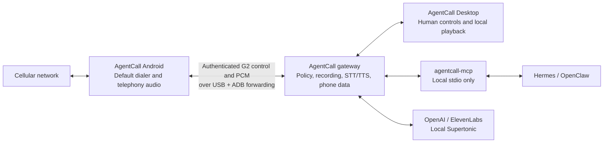

The supported runtime has no SIP, RTP, Asterisk, STUN, LAN call listener,
Wi-Fi phone transport, or remote MCP endpoint. Android listens on loopback,
the gateway owns the ADB forward, and desktop/MCP clients use bounded local
interfaces. See the full [architecture](docs/ARCHITECTURE.md) and
[threat model](docs/security/threat-model-and-recording-controls.md).

## Agent and speech integrations

<table>
  <tr>
    <td align="center" width="16%"><br><strong>Hermes Agent</strong><br><sub>Local reasoning and call control</sub></td>
    <td align="center" width="16%"><br><strong>OpenClaw</strong><br><sub>Local reasoning and call control</sub></td>
    <td align="center" width="16%"><br><strong>Groq</strong><br><sub>Realtime Whisper STT, PlayAI/Orpheus TTS, Llama conversation</sub></td>
    <td align="center" width="16%">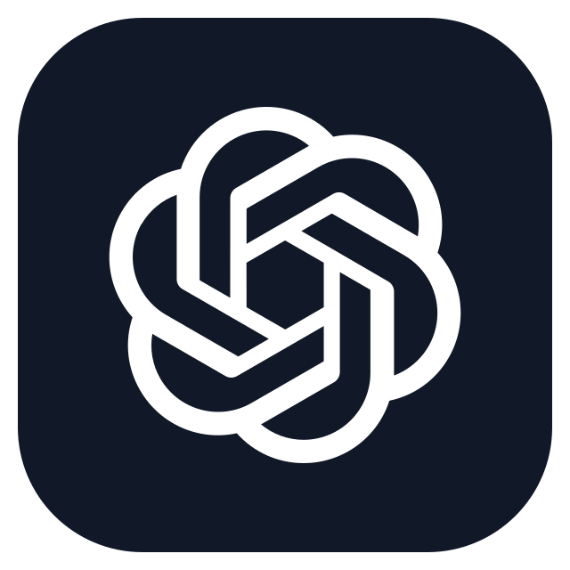<br><strong>OpenAI</strong><br><sub>Realtime transcription and speech</sub></td>
    <td align="center" width="16%"><br><strong>ElevenLabs</strong><br><sub>Realtime transcription and speech</sub></td>
    <td align="center" width="16%"><br><strong>Supertonic</strong><br><sub>Local text to speech</sub></td>
  </tr>
</table>

## Application Tour

Screenshots use fictional sample data. Click any image to open its original,
lossless PNG from the [`screenshots/`](screenshots/README.md) directory.

### AgentCall Desktop

<table>
  <tr>
    <td width="50%" align="center"><a href="screenshots/desktop/agentcall-readme-desktop-calls.png">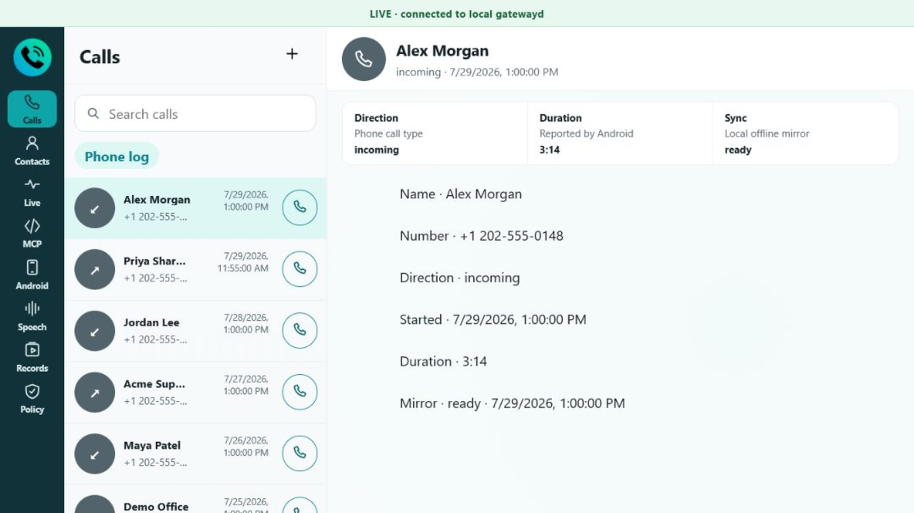</a><br><sub><strong>Calls</strong> — synchronized history and one-click calling</sub></td>
    <td width="50%" align="center"><a href="screenshots/desktop/agentcall-readme-desktop-contacts.png">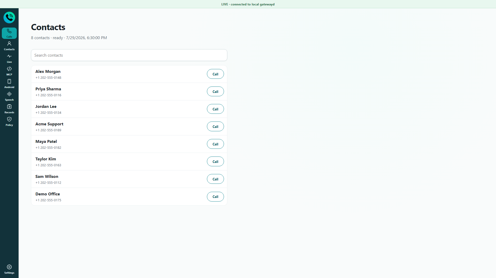</a><br><sub><strong>Contacts</strong> — searchable local phone mirror</sub></td>
  </tr>
  <tr>
    <td align="center"><a href="screenshots/desktop/agentcall-readme-desktop-live.png">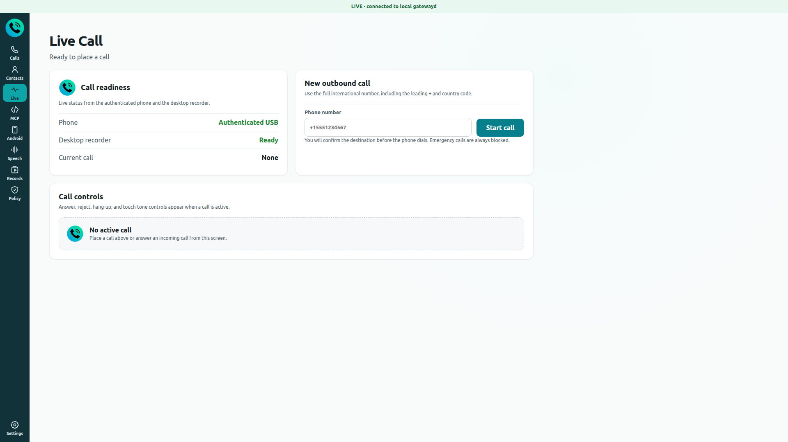</a><br><sub><strong>Live Call</strong> — place and control cellular calls</sub></td>
    <td align="center"><a href="screenshots/desktop/agentcall-readme-desktop-android.png">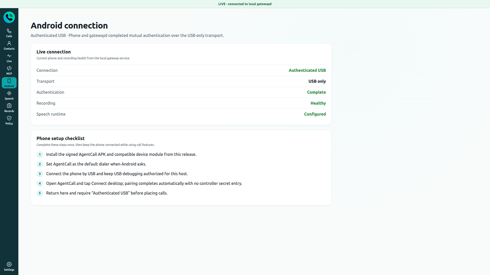</a><br><sub><strong>Android connection</strong> — authenticated USB and recording health</sub></td>
  </tr>
  <tr>
    <td align="center"><a href="screenshots/desktop/agentcall-readme-desktop-speech.png">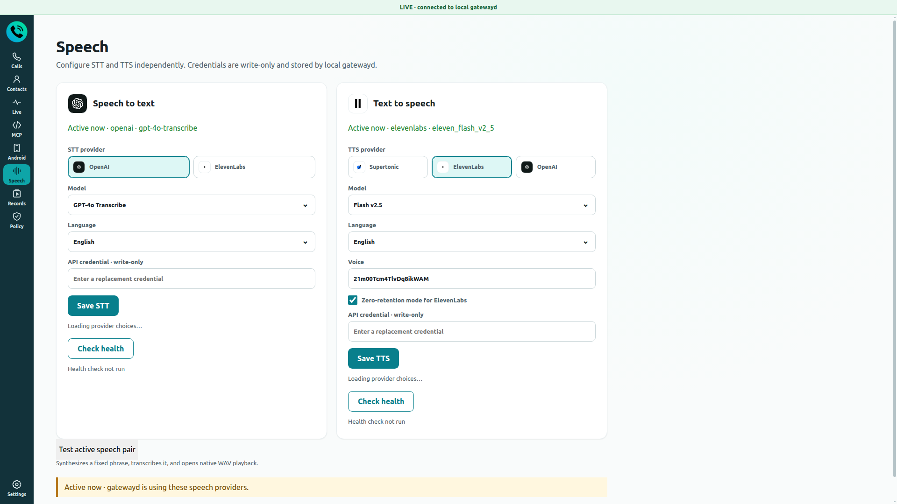</a><br><sub><strong>Speech</strong> — provider, model, language, and voice</sub></td>
    <td align="center"><a href="screenshots/desktop/agentcall-readme-desktop-mcp.png">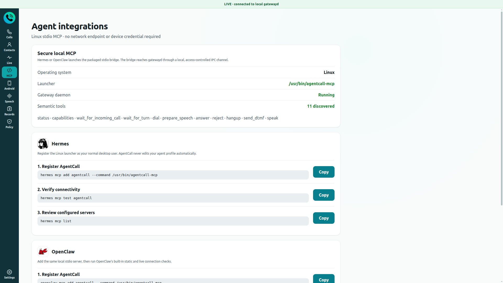</a><br><sub><strong>Agent integrations</strong> — local Hermes and OpenClaw setup</sub></td>
  </tr>
  <tr>
    <td align="center"><a href="screenshots/desktop/agentcall-readme-desktop-recordings.png">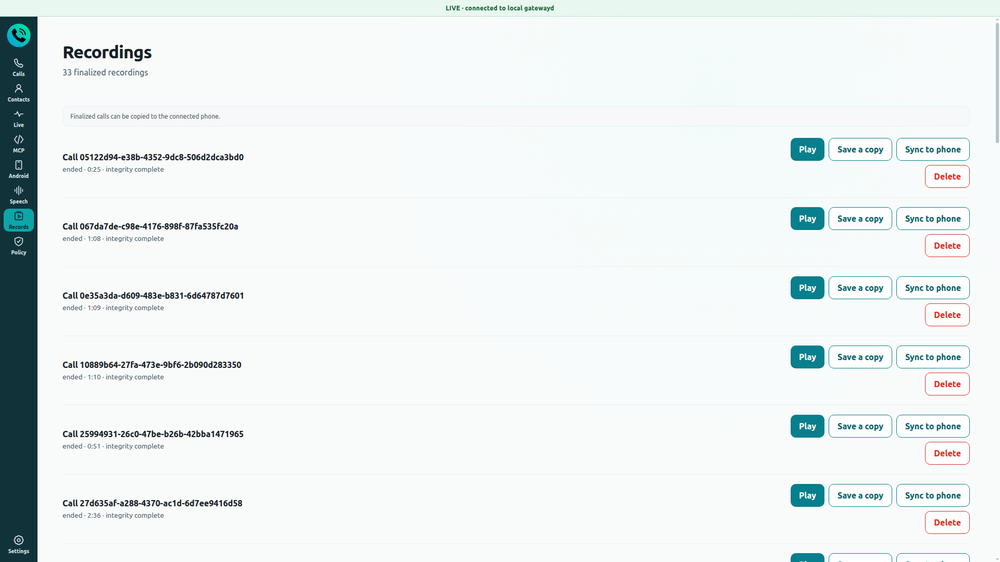</a><br><sub><strong>Recordings</strong> — play, export, and synchronize finalized calls</sub></td>
    <td align="center"><a href="screenshots/desktop/agentcall-readme-desktop-settings.png">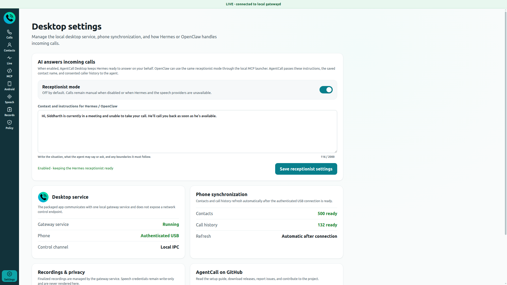</a><br><sub><strong>Settings</strong> — AI receptionist context and phone synchronization</sub></td>
  </tr>
  <tr>
    <td colspan="2" align="center"><a href="screenshots/desktop/agentcall-readme-desktop-policy.png">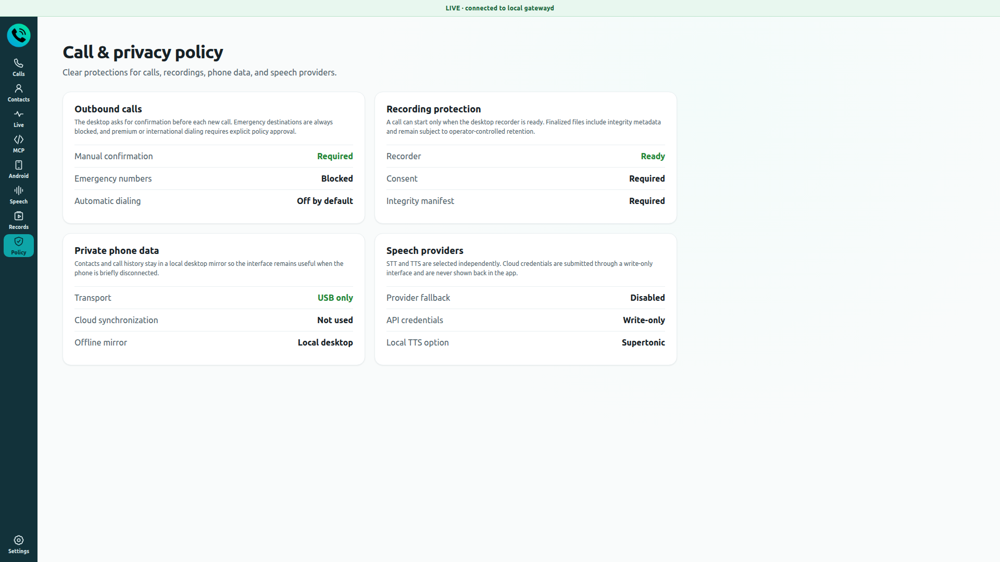</a><br><sub><strong>Policy</strong> — call, recording, privacy, and provider protections</sub></td>
  </tr>
</table>

### AgentCall for Android

<table>
  <tr>
    <td width="33%" align="center"><a href="screenshots/android/agentcall-readme-android-recents.png">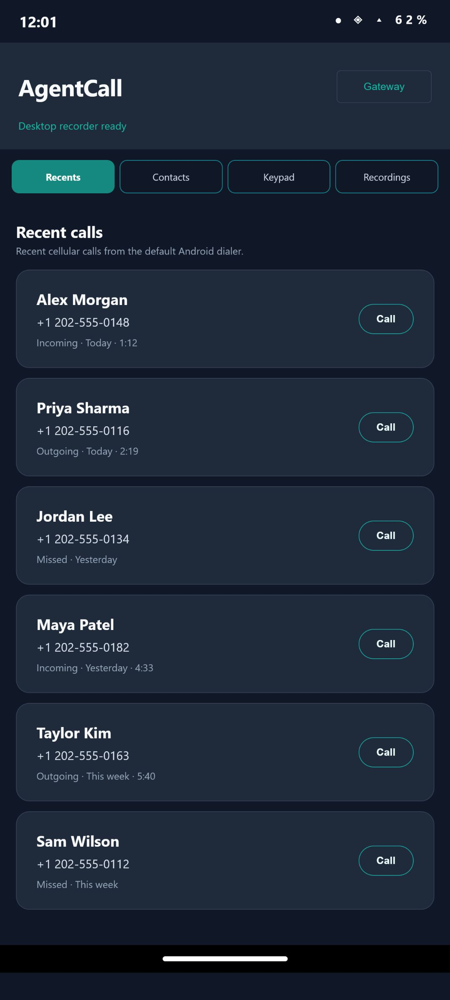</a><br><sub><strong>Recents</strong> — cellular call history</sub></td>
    <td width="33%" align="center"><a href="screenshots/android/agentcall-readme-android-contacts.png">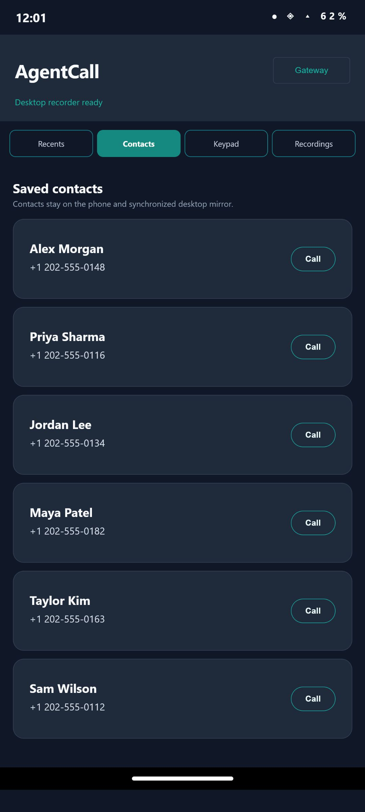</a><br><sub><strong>Contacts</strong> — saved names and one-tap calls</sub></td>
    <td width="33%" align="center"><a href="screenshots/android/agentcall-readme-android-keypad.png">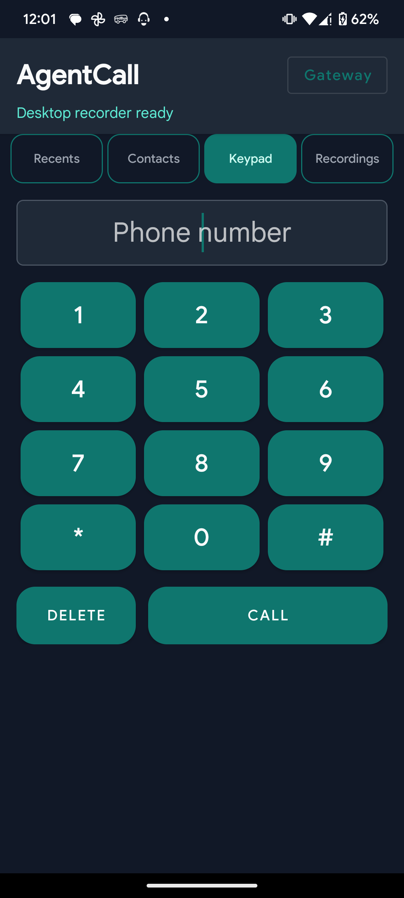</a><br><sub><strong>Keypad</strong> — native cellular dialing</sub></td>
  </tr>
</table>

<table>
  <tr>
    <td width="50%" align="center"><a href="screenshots/android/agentcall-readme-android-gateway.png">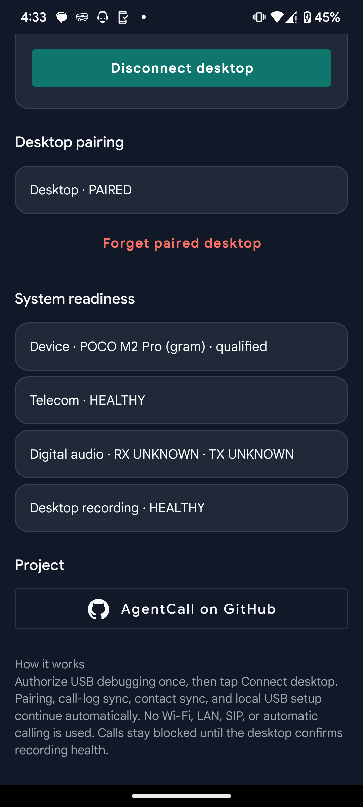</a><br><sub><strong>Gateway</strong> — pairing and device readiness</sub></td>
    <td width="50%" align="center"><a href="screenshots/android/agentcall-readme-android-recordings.png">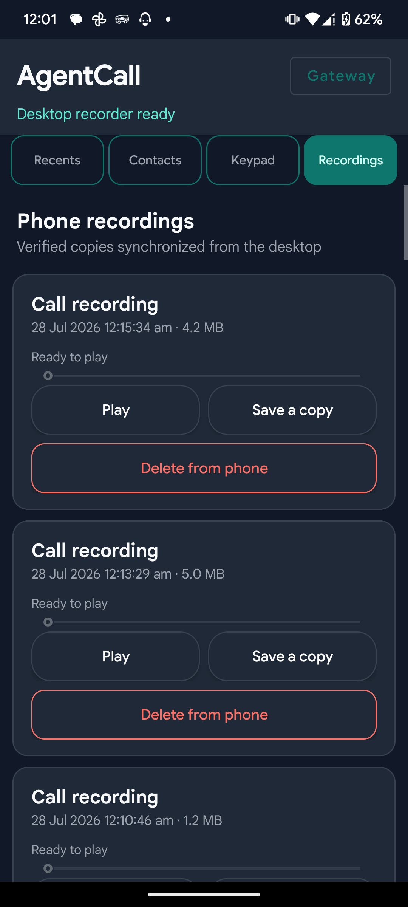</a><br><sub><strong>Recordings</strong> — playback, save, and deletion</sub></td>
  </tr>
</table>

## Release downloads

Download the current files from
[AgentCall v1.0.1](https://github.com/sidinsearch/AgentCall/releases/tag/v1.0.1).

| Asset | Use |
|---|---|
| `agentcall-desktop-1.0.1-x64-setup.exe` | Windows 10/11 x86-64 desktop, managed gateway, ADB, and FFmpeg |
| `agentcall-desktop-1.0.1-amd64.deb` | Debian/Ubuntu x86-64 desktop, gateway service, MCP launcher, and recovery tools |
| `AgentCall-privileged-1.0.1-333-magisk.zip` | Qualified rooted-phone path; includes the matched APK and protected permissions |
| `AgentCall-1.0.1-333.apk` | Ordinary Android UI/development installation without protected telephony audio |

SHA-256 checksums are published in the GitHub release notes.

On Linux, verify the files you downloaded:

```bash
sha256sum agentcall-desktop-1.0.1-amd64.deb \
  AgentCall-1.0.1-333.apk \
  AgentCall-privileged-1.0.1-333-magisk.zip
```

On Windows, compare the result with the matching checksum in the release notes:

```powershell
Get-FileHash -Algorithm SHA256 .\agentcall-desktop-1.0.1-x64-setup.exe
```

## Installation

### 1. Install Android

Requirements:

- a dedicated phone with an active SIM;
- USB debugging enabled;
- AgentCall selected as the default Phone application;
- Magisk for the privileged full-duplex path.

Choose exactly one Android installation method.

#### Qualified Magisk module

1. Copy `AgentCall-privileged-1.0.1-333-magisk.zip` to the phone.
2. Review and install it from Magisk.
3. Require a successful installer result and reboot.
4. Open AgentCall and select it as the default Phone application.
5. Do not install the standalone APK beside the module.

#### Ordinary APK

Use the APK for UI or development validation without protected telephony audio:

```bash
adb install AgentCall-1.0.1-333.apk
```

Verify the installed state:

```bash
adb shell pm path com.callagent.gateway
adb shell dumpsys package com.callagent.gateway
adb shell cmd role get-role-holders android.app.role.DIALER
```

The expected package is `com.callagent.gateway`, version `1.0.1 (333)`, and
the dialer role must name AgentCall.

### 2. Install AgentCall Desktop

#### Windows

1. Run `agentcall-desktop-1.0.1-x64-setup.exe`.
2. Choose the installation directory and finish setup.
3. Open **AgentCall Desktop** from Start or its desktop shortcut.

The Windows package supervises its local gateway and includes the required ADB
and FFmpeg tools. Provider keys and recordings remain in the current Windows
user's application-data directory.

#### Debian or Ubuntu

```bash
sudo apt install ./agentcall-desktop-1.0.1-amd64.deb
sudo apt install adb ffmpeg python3
```

Verify the installed service and recording path:

```bash
sudo systemctl status agentcall-gatewayd
sudo agentcall-health
sudo agentcall-recorder-health
```

Launch the desktop from the application menu or run:

```bash
agentcall-desktop
```

Linux service names and state paths retain the `agentcall` identifier for safe
upgrades from earlier builds. They are stable internal compatibility names,
not the product name shown to users.

### 3. Connect the phone

1. Connect exactly one phone over physical USB.
2. Review and approve Android's USB-debugging prompt for this computer.
3. Open AgentCall on Android and press **Connect desktop**.
4. Wait for both applications to show the phone as authenticated and ready.
5. Confirm recording health before placing or answering a call.

For upgrades, rollback, troubleshooting, and uninstall instructions, use the
complete [installation guide](docs/INSTALL.md).

## Speech configuration

Open **AgentCall Desktop → Speech**.

1. Select an STT provider and model.
2. Select a TTS provider, model, language, and voice.
3. Enter the provider key when required.
4. Save the configuration.
5. Run the provider test and complete speech-pair test.

| Function | Supported providers |
|---|---|
| Speech to text | Groq Whisper, OpenAI realtime transcription, ElevenLabs Scribe realtime |
| Text to speech | Groq PlayAI / Orpheus, ElevenLabs streaming TTS, OpenAI TTS, local Supertonic |
| AI conversation | Groq Llama chat models (llama-3.3-70b-versatile and more), OpenCode Zen free models (big-pickle and more) |

Provider keys are write-only: the desktop renderer and MCP server cannot read
them back. Changing the TTS provider, model, voice, or language invalidates the
prepared-audio cache and regenerates openings in the new voice.

Linux administrators may configure `/etc/agentcall/gateway.env` directly. Keep
it owned by `root:agentcall`, mode `0640`, and never place provider keys in Git,
MCP configuration, screenshots, or command arguments. See the
[provider contract](docs/realtime-provider-contract.md).

## Groq models (ArynoxTech)

Arynox AI Call Assistant ships native Groq support so a single
[Groq API key](https://console.groq.com/keys) can power the whole voice loop:

| Function | Groq model | Role |
|---|---|---|
| Speech to text | `whisper-large-v3-turbo`, `whisper-large-v3`, `distil-whisper-large-v3-en` | Transcribes the caller |
| Text to speech | `playai-tts`, `playai-tts-arabic`, `canopylabs/orpheus-v1-english`, `canopylabs/orpheus-arabic-saudi` | Speaks as the agent |
| Conversation brain | `llama-3.3-70b-versatile` and other Llama chat models | Generates natural live replies |

Select **Groq** in **Desktop → Speech** for STT, TTS, or both, enter your
`gsk_...` key, and save. The gateway stores the key write-only. The Groq
conversation responder is available to agents as
`GroqConversationResponder` (chat completions with bounded history, timeout,
and abort handling) — see `pc/pc-gateway/src/groq-conversation-responder.js`.
Never put your Groq key in Git, MCP config, screenshots, or command arguments.

## OpenCode Zen free models (ArynoxTech)

The conversation brain can also run on [OpenCode Zen](https://opencode.ai/docs/zen)
with a single [OpenCode API key](https://opencode.ai/auth) — several models are
free, so you can run AI calls at zero cost:

| Function | OpenCode Zen model | Role |
|---|---|---|
| Conversation brain | `big-pickle` (default), plus rotating free models such as `deepseek-v4-flash-free`, `mimo-v2.5-free` | Generates natural live replies |

Zen is chat-only: pair it with Groq (or another provider) for STT and TTS.
Set `OPENCODE_API_KEY` in the environment (or pass it via `run.bat`) and run:

```
cd pc/pc-gateway
set AGENTCALL_QUALIFICATION_PHONE=+15551234567
set AGENTCALL_QUALIFICATION_CALL_APPROVED=yes
set AGENTCALL_BRAIN_PROVIDER=opencode
npm run ai:call
```

`AGENTCALL_BRAIN_PROVIDER` accepts `groq`, `opencode`, or `openai`; keys are
read from the environment first, then from saved Speech settings. The Zen
responder is available to agents as `OpenCodeConversationResponder`
(`https://opencode.ai/zen/v1/chat/completions`, OpenAI-compatible) — see
`pc/pc-gateway/src/opencode-conversation-responder.js`. The free catalog
rotates; any well-formed model id is accepted.

## Hermes / OpenClaw MCP

AgentCall exposes MCP `2024-11-05` over local stdio. It does not expose a
network MCP endpoint.

### Add AgentCall to Hermes or OpenClaw

On Linux, add the local MCP launcher to Hermes:

```bash
hermes mcp add agentcall --command /usr/bin/agentcall-mcp
hermes mcp test agentcall
hermes mcp list
```

OpenClaw uses the same launcher. On Windows, open
**AgentCall Desktop → MCP** and copy the displayed `agentcall-mcp.cmd` path
into Hermes or OpenClaw. AgentCall MCP is local stdio—do not add a network URL.

The semantic tools are:

`status` · `capabilities` · `wait_for_incoming_call` · `wait_for_turn` ·
`dial` · `prepare_speech` · `answer` · `reject` · `hangup` · `send_dtmf` ·
`speak`

AgentCall prepares openings and likely replies before a call, then keeps live
conversation context, handles interruptions, and closes naturally. Incoming
AI pickup reuses time-aware prepared speech; changing its instructions or TTS
voice refreshes that audio automatically.

Canonical MCP resources use the `agentcall://` namespace.

See the [MCP guide](docs/MCP.md) for schemas and lifecycle rules and the
[voice-mode guide](docs/AGENT_VOICE_MODE.md) for production conversation and
latency behavior.

## Calling modes

| Mode | Operation |
|---|---|
| Human-operated | Start or answer from the desktop, then select **Use PC microphone and speakers** |
| Agent outgoing | Ask Hermes/OpenClaw to call with an objective and relevant context |
| AI incoming receptionist | Enable **AI answers incoming calls** and save the context/instructions in Settings |

Agent-managed calls have a five-minute maximum. Emergency numbers are always
blocked. Outgoing calls remain subject to local approval, strict E.164
validation, consent, recording health, policy, cooldown, and rate limits.

## Recordings and phone data

- Contacts and call history synchronize privately from the connected phone.
- Calls are stored locally as separate remote and agent tracks plus a mixed
  conversation artifact.
- Desktop and Android provide in-app playback.
- Desktop can export a recording to a user-selected location.
- Finalized recordings automatically copy back to Android after capability and
  integrity checks; failed transfers remain queued for the next authenticated
  connection.
- Caller memory is local, consent-bound, expiring, and disabled until enabled
  by the operator.

## Security model

- Exactly one matched, ADB-authorized phone is accepted.
- Android listens on loopback only; the gateway owns the ADB forward.
- Controller authentication is mutual and replay protected.
- The Electron renderer is sandboxed behind a bounded local bridge.
- MCP exposes semantic JSON rather than PCM, provider keys, raw ADB traffic,
  contact rows, or unredacted receipts.
- Recording health blocks dial, answer, and DTMF.
- Emergency destinations are always denied.
- Secrets and private identifiers are excluded from logs and screenshots.

Security-sensitive deployments should review the complete
[threat model and recording controls](docs/security/threat-model-and-recording-controls.md).

## Build and verification

Development requirements include JDK 17, Node.js 20 or newer, Python 3, the
Android SDK, ADB, and FFmpeg.

Clone and run the canonical verifier on Linux:

```bash
git clone https://github.com/sidinsearch/AgentCall.git
cd AgentCall
./verify.sh
```

`verify.sh` runs Android unit tests, lint, and assembly; gateway and MCP tests;
desktop security and IPC tests; package boundaries; release evidence; and
USB-only production-surface checks. It does not install software, modify a
phone, place a call, or contact paid providers.

Focused checks from the repository root:

```bash
./gradlew :app:testDebugUnitTest :app:lintDebug :app:assembleDebug

npm ci --prefix pc/pc-gateway
npm test --prefix pc/pc-gateway
npm run check --prefix pc/pc-gateway

npm ci --prefix pc/pc-gateway/ui
npm test --prefix pc/pc-gateway/ui
npm run check --prefix pc/pc-gateway/ui
```

Build qualification artifacts:

```bash
packaging/android/build-artifacts.sh \
  --apk app/build/outputs/apk/debug/app-debug.apk \
  --output release/android \
  --version-name 1.0.1 \
  --version-code 333

packaging/linux/build-unified-desktop-deb.sh \
  --output "$PWD/release/desktop"
```

Production Android signing requires an operator-controlled keystore outside
the repository and the guarded
`packaging/android/build-production-release.sh` workflow.

## Project status

| Area | Status |
|---|---|
| Automated verification | Android, gateway/MCP, desktop, packaging, and production-boundary gates |
| Physical Android | POCO M2 Pro qualified for authenticated USB, cellular audio, calls, and recording sync |
| Windows desktop | Installed and physically exercised with PC audio, providers, MCP, playback, and export |
| Linux desktop | Installed and physically exercised with UI, providers, MCP, calling, recording, and icon integration |
| Distribution signing | Android qualification signer only; Windows and Debian packages unsigned |
| Broad device support | Not qualified beyond the documented POCO tuple |

See [RELEASE_STATUS.md](docs/RELEASE_STATUS.md) for exact evidence, remaining
distribution gates, and the distinction between hardware qualification and
broad production distribution.

## Contributing

Contributions are welcome for desktop UI, Android dialer behavior, speech
adapters, MCP clients, tests, documentation, and carefully qualified device
ports. Start with [CONTRIBUTING.md](CONTRIBUTING.md), run `./verify.sh`, and
state which physical hardware checks were performed.

Never attach real phone numbers, credentials, caller identities, recordings,
ADB keys, or provider keys to an issue or pull request.

## Acknowledgements

The qualified POCO M2 Pro path is possible because of:

- the POCO M2 Pro / Xiaomi `miatoll` Android community, including the
  [LineageOS miatoll device tree](https://github.com/LineageOS/android_device_xiaomi_miatoll);
- Xiaomi's published
  [`gram-q-oss` kernel source](https://github.com/MiCode/Xiaomi_Kernel_OpenSource/tree/gram-q-oss);
- [Magisk](https://github.com/topjohnwu/Magisk) and its module framework;
- the Android Open Source Project, Android platform tools, FFmpeg, Electron,
  Node.js, and the dependencies listed by the build manifests.

Agent and speech integrations are built around
[Hermes Agent](https://github.com/NousResearch/hermes-agent),
[OpenClaw](https://github.com/openclaw/openclaw),
[OpenAI](https://openai.com/),
[ElevenLabs](https://elevenlabs.io/), and
[Supertonic](https://github.com/supertone-inc/supertonic). Their names and
artwork identify interoperability only; no endorsement is claimed.

## License

GNU Affero General Public License v3.0 only. See [LICENSE](LICENSE) and
[NOTICE](NOTICE). Included components and brand assets retain their own terms;
see [THIRD_PARTY_NOTICES.md](THIRD_PARTY_NOTICES.md).
